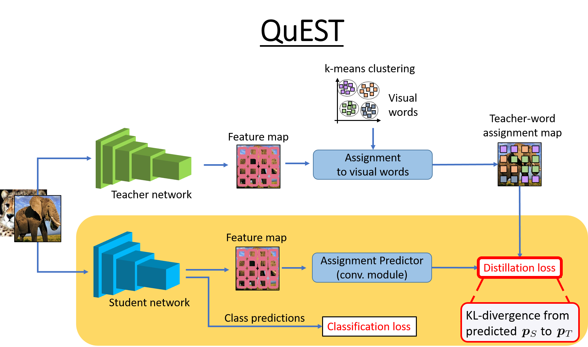

# QuEST: Quantized embedding space for transferring knowledge
This is pytorch implementation for [QuEST](https://www.ecva.net/papers/eccv_2020/papers_ECCV/papers/123660171.pdf), an approach for knowledge distillation.

[](https://www.youtube.com/watch?v=bJyJkAhjp88)

**Paper:** [QuEST: Quantized embedding space for transferring knowledge](https://www.ecva.net/papers/eccv_2020/papers_ECCV/papers/123660171.pdf)
**Authors:** Himalaya Jain, Spyros Gidaris, Nikos Komodakis, Patrick Pérez, Matthieu Cord
**arXiv:** https://arxiv.org/abs/1912.01540

If you find this repo useful for your research, please consider citing the paper.
```
@article{jain2019quest,
  title={QUEST: Quantized embedding space for transferring knowledge},
  author={Jain, Himalaya and Gidaris, Spyros and Komodakis, Nikos and P{\'e}rez, Patrick and Cord, Matthieu},
  journal={arXiv preprint arXiv:1912.01540},
  year={2019}
}
```
### **License**
This code is released under the MIT License (refer to the LICENSE file for details).

## **Preparation**

### **Pre-requisites**
* Python 3.7
* Pytorch >= 1.3.1
* CUDA 10.0 or higher

#### Installation

**(1)** Clone the repo:
```bash
git clone https://github.com/valeoai/quest
```


**(2)** Install this repository and the dependencies using pip:
```bash
# Install the faiss library (for k-means)
conda install faiss-cpu -c pytorch
conda install faiss-gpu cudatoolkit=10.0 -c pytorch
# Install QuEST
pip install -e ./quest
```

With this, you can edit the QuEST code on the fly and import function
and classes of QuEST in other projects as well.   

**(3)** Optional. To uninstall this package, run:
```bash
$ pip uninstall quest
```

#### Datasets
The datasets are expected to be split into train and test data in different folders, which is the default for ImageNet and CIFAR100. For [MIT-67](http://web.mit.edu/torralba/www/indoor.html), please use distillation/datasets/preprocess_mit_dataset.py to structure it properly. 

#### Teacher models
**ImageNet**: We use the pre-trained model provided by torchvision.models.\
**CIFAR100**: Run download_cifar100_teacher.py to download all the teachers models used in the paper for CIFAR100. 

#### Config files
Config files named as <*TeacherNetwork*> or <*TeacherNetwork_StudentNetwork*>.

To evaluate the teacher or to learn K-means, use <*TeacherNetwork*> config file eg. WRN40w2.py, RN56.py, VGG13.py.

To train or evaluate student model, use <*TeacherNetwork_StudentNetwork*>, eg. WRN40w2_WRN16w2.py from the config folder.

#### Evaluate teacher network:
```bash
python scripts/main_classification.py with config=Config_CIFAR100.<TeacherNetwork> evaluate=True data_dir=<PathToDataset>
# output logs are stored at ./experiments/Config_CIFAR100/<TeacherNetwork>/
```

#### Learn K-means codebook:
```bash
python scripts/main_classification.py with config=Config_CIFAR100.<TeacherNetwork> kmeans=4096 data_dir=<PathToDataset>
# The learned codebook will be stored at ./experiments/VQ/Config_CIFAR100/<TeacherNetwork>/
```

#### Train student:
```bash
python scripts/main_classification.py with config=Config_CIFAR100.<TeacherNetwork_StudentNetwork> data_dir=<PathToDataset>
# The trained model files and logs are at ./experiments/Config_CIFAR100/<TeacherNetwork_StudentNetwork>/
```

#### Evaluate student network:
```bash
python scripts/main_classification.py with config=Config_CIFAR100.<TeacherNetwork_StudentNetwork> evaluate=True data_dir=<PathToDataset>
# It uses the last saved model from ./experiments/Config_CIFAR100/<TeacherNetwork_StudentNetwork>/.
# To evaluate the best model give 'best=True' as command line argument.
# To evaluate any model, create a config file with the model paths and other info. For example see <TeacherNetwork> config files.
```


#### Example WRN40w2 -> WNR16w2 on CIFAR100:
```bash
# Evaluate the WRN40w2 teacher.
python scripts/main_classification.py with config=Config_CIFAR100.WRN40w2 evaluate=True data_dir=./datasets/CIFAR/
# Learn a k-means vocabulary of 4096 words for the WRN40w2 student. It will be stored at ./experiments/VQ/Config_CIFAR100/WRN40w2/
python scripts/main_classification.py with config=Config_CIFAR100.WRN40w2 kmeans=4096 data_dir=./datasets/CIFAR/
# Train a WRN16w2 student with WRN40w2 as teacher using the QuEST knowledge distillation algorithm. The trained model files and logs will be at ./experiments/Config_CIFAR100/WRN40w2_WRN16w2 
python scripts/main_classification.py with config=Config_CIFAR100.WRN40w2_WRN16w2 data_dir=./datasets/CIFAR/
# Evaluate the WRN16w2 student.
python scripts/main_classification.py with config=Config_CIFAR100.WRN40w2_WRN16w2 evaluate=True best=True data_dir=./datasets/CIFAR/
```


#### Example RN34 -> RN18 on ImageNet:
```bash
# Evaluate the RN34 teacher.
python scripts/main_classification.py with config=Config_ImageNet.RN34 evaluate=True data_dir=/datasets_local/ImageNet/
# No need to learn the k-means vocabulary. We already provide it.
# Train a RN18 student with RN34 as teacher using the QuEST knowledge distillation algorithm. The trained model files and logs will be at ./experiments/Config_ImageNet/RN34_RN18
python scripts/main_classification.py with config=Config_ImageNet.RN34_RN18 data_dir=/datasets_local/ImageNet/
# Evaluate the RN18 student.
python scripts/main_classification.py with config=Config_ImageNet.RN34_RN18 evaluate=True data_dir=/datasets_local/ImageNet/
```

#### Example RN34 -> RN18 on MIT67 dataset (80 images per class)
```bash
# No need to learn the k-means vocabularies. We already provide them on
# Train a RN18 student with RN34 as teacher using the QuEST knowledge distillation algorithm. The trained model files and logs will be at ./experiments/Config_TransferLearning/RN34_RN18_IMG80
python scripts/main_classification.py with config=Config_TransferLearning.RN34_RN18_IMG80 data_dir=/datasets_local/MITScenes67/
# Evaluate the WRN16w2 student.
python scripts/main_classification.py with config=Config_TransferLearning.RN34_RN18_IMG80 evaluate=True testset=True data_dir=/datasets_local/MITScenes67/
```
